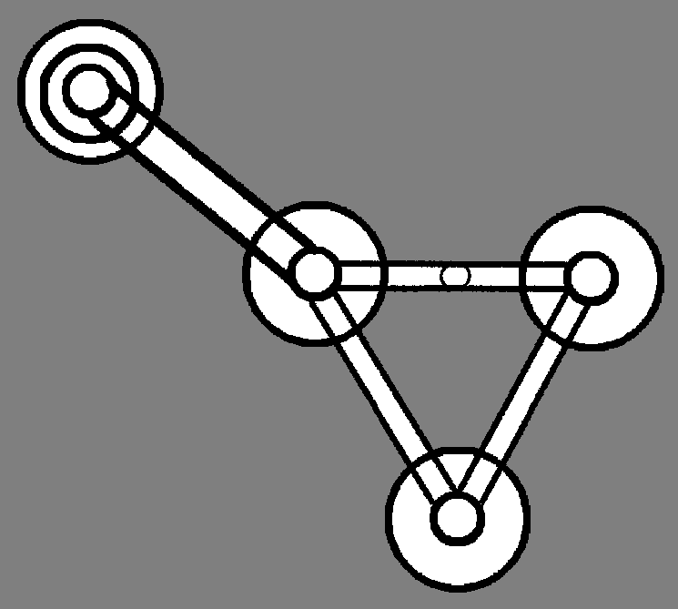
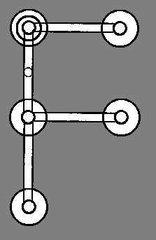

# Your first programs

# 1 A basic program

The above program is very simple indeed: it starts in the start circle (top left), crosses the normal path, and ends up in the normal circle (bottom right); since there is nowhere to from the normal circle without traversing the path which led to the circle (which is illegal in Circles), the program halts. This program is basically just a fancy nop, but demonstrates some basic features of the language, such as circles and normal paths.

# 2 Another basic program

The program shown here appears complicated than the previous one, yet is in reality still fairly simple. It starts in the start circle (top left), and then moves southeast to the northwesternmost normal circle. From there, it moves east instead of southeast, due to the priority path, then moves southwest, then northwest, and then sees the priority path once more and goes down it again, and thus the cycle continues for all of eternity (or until you kill the program). This program is an infinite loop, and demonstrates priority paths.

# 3 A slightly more advanced program

This program demonstrates the use of priority paths, as well as what happens when paths are ambiguous. The program starts in the start circle (top left), then goes down instead of right because the path going down is a priority path, while the path going to the right is just a normal path. The normal circle it arrives at has two possible paths (going right and down), both normal this time, so an error is thrown due to the ambiguity created.
